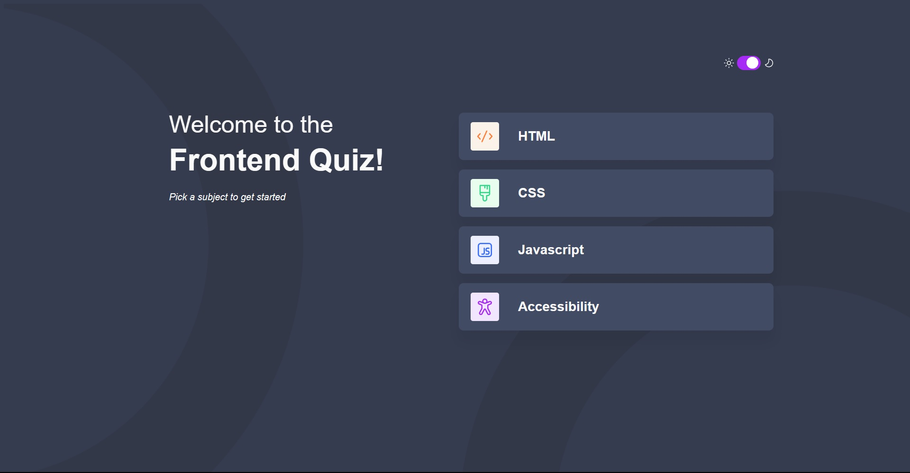
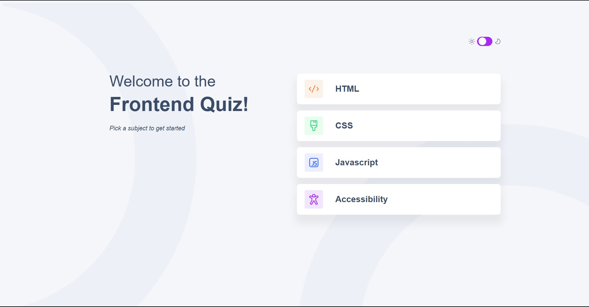

# Quiz App

## Table of contents

- [Overview](#overview)
  - [The challenge](#the-challenge)
  - [Screenshots](#screenshots)
  - [Links](#links)
- [My process](#my-process)
  - [Built with](#built-with)
  - [What I learned](#what-i-learned)
  - [Continued development](#continued-development)
  - [Useful resources](#useful-resources)
- [Author](#author)
- [Acknowledgments](#acknowledgments)


## Overview

### The challenge

Users should be able to:

- Select a quiz subject
- Select a single answer from each question from a choice of four
- See an error message when trying to submit an answer without making a selection
- See if they have made a correct or incorrect choice when they submit an answer
- Move on to the next question after seeing the question result
- See a completed state with the score after the final question
- Play again to choose another subject
- View the optimal layout for the interface depending on their device's screen size
- See hover and focus states for all interactive elements on the page
- Navigate the entire app only using their keyboard
- **Bonus**: Change the app's theme between light and dark

### Screenshots





### Links

- Sourcode: [Quiz-app/github](https://github.com/mr-kaakyire/Quiz-app)
- Live Site: [quiz-app.live](https://quiz-app-pearl-three.vercel.app/)

## My process

### Built with

- Semantic HTML5 markup
- Flexbox
- CSS Grid
- Mobile-first workflow
- [React](https://reactjs.org/) - JS library
- [React-router-dom](https://reactrouter.com/en/main) - React library
- [Styled Components](https://styled-components.com/) - For styles


### What I learned

#### React Router
- Implementing React-router allowed me to navigate between different pages without reloading the entire page, making the app feel like a single-page application.
##### Implementation
```js
 //main.tsx
import React from 'react'
import ReactDOM from 'react-dom/client'
import {
  createBrowserRouter,
  RouterProvider,
} from "react-router-dom";
import LayOut from './routes/LayOut.tsx';
import HomePage from './pages/HomePage.tsx';
import ExercisePage from './pages/ExercisePage.tsx';
import CompletedPage from './pages/CompletedPage.tsx';

const router = createBrowserRouter([
  {
    path: "/",
    element: <LayOut children={undefined}/>,
    children:[
      {path:'/',element:<HomePage/>},
      {path:'/:exercise-type',element:<ExercisePage/>},
      {path:'/completed/:exercise-type/:score',element:<CompletedPage/>},
      
    ]
  },
]);


ReactDOM.createRoot(document.getElementById('root')!).render(
  <React.StrictMode>
    <RouterProvider router={router}/>
  </React.StrictMode>,
)
```
##### Dynamic Segments
- It also allows for dynamic segments which allows URL parameters to be passed to the link. 

```js
//main.tsx
 {path:'/:exercise-type',element:<ExercisePage/>},
 {path:'/completed/:exercise-type/:score',element:<CompletedPage/>},
```
##### Outlet
- It provides an Outlet component that allows you to dynamically change some parts of your page by changing the link. This avoids writing repetative code for components in your site that does not change across different pages

```js
//Layout.tsx
import { Outlet} from 'react-router-dom'
<div className='banner'>
               
                <OutletContainer>
                    <Outlet />
                </OutletContainer>
            </div>
}
```


### Continued development
- React is a very powerful libray and I believe I have only scratched the surface. In the future I would like to work on projects that forces me to use and understand more react hooks
- Again Styled components is so amazing and I would to use it more often and tests its limits.


### Useful resources

- [react-router-dom](https://reactrouter.com/en/main) - I used this for client-side routing. I really love this because it was quick and intuitive to use.
- [styled-components](https://styled-components.com/docs/basics) - This is also an amazing react library that allows you to manipulate your CSS with Javascript. It's usage is very intuitive and easy as well. And it made my life a whole lot easier when I was implementing the darkmode feature. I would probably recommend this over frontend libraries like tailwind
- [W3 Schools](https://www.w3schools.com/) - Anytime I need a quick HTML,CSS and React refreshers this is where I go.

### Acknowledgments
I will like to sincerely thank the Amalitech Training Programme team for giving me the opportunity to work on this project

## Author

- Website - [Mr-Kaakyire](https://mrkaakyire.vercel.app/)
- Linkedin - [Emmanuel Boahen](https://www.linkedin.com/in/emmanuel-boahen-351850206/)


